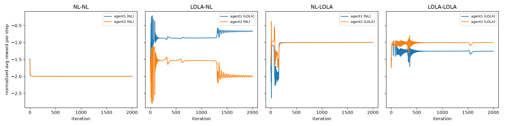
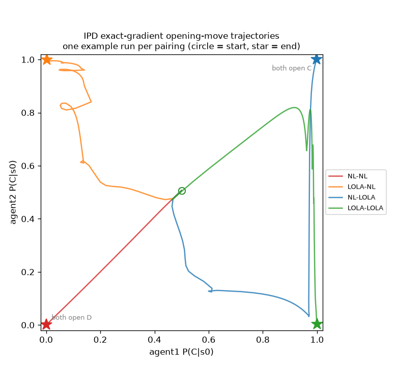

# Results

**Status (2026-09-09): initial build complete, two post-build corrections
(Sections 2b and 2c). 19/19 unit tests passing. All three experiment
scripts run end-to-end at the scale reported below (50 seeds for the
exact-gradient experiments, 20 seeds for the noisier policy-gradient one).
This file records what was actually run and found, including two real
bugs and one hyperparameter correction caught during
development/review, not a claim of a finished, paper-scale replication.**

## 2c. Found the paper's actual authors' code, cross-checked hyperparameters and formula against it, corrected the IPD exact-gradient step size

The user found and pointed to the paper's own released code,
[github.com/alshedivat/lola](https://github.com/alshedivat/lola) (cloned
read-only to a scratch directory for reference; never imported or used as
a dependency — this repo's `foerster2018/exact/lola.py` is still its own
independent implementation, built before this cross-check happened).
Three things were checked against it:

1. **The second-order correction's construction.** `alshedivat/lola` has
   *two* independent implementations of the same LOLA update:
   `train_exact.py::corrections_func` (used by `scripts/run_lola.py`) and
   `tournament.py::ExactLOLA._build_update` (used by the round-robin
   tournament). Both build the correction the same way this repo's
   `lola_correction()` does: a first-order cross-gradient
   (`grad_theta2 V1`) held constant via `tf.stop_gradient` (this repo's
   `.detach()`), dotted against the opponent's own naive gradient
   (`grad_theta2 V2`), then differentiated once more with respect to
   theta1. Two independently-written reference implementations agreeing
   with this repo's own construction is a stronger correctness signal
   than the earlier Codex review alone (Section 1) — it rules out this
   repo having converged on a formula that merely *passes its own tests*
   but differs from the paper's actual intended construction.

2. **Hyperparameters used by the released code.** `train_exact.py`'s CLI
   (`scripts/run_lola.py`) defaults to `gamma=0.96` for IPD and `gamma=0.9`
   for IMP (both already matched here) and `lr=1.0`, `lr_correction=1`
   (via the CLI's own default, though the function signature's own
   default is `lr_correction=0.5`) for the exact-gradient IPD/IMP
   experiment — i.e. `delta=eta=1.0` in this repo's notation. This repo
   tested that exact configuration directly
   (`run_experiment1_ipd_exact.py --delta 1.0 --eta 1.0 --iterations 200`,
   matching the CLI's `trace_length=200`) and found the asymmetric
   LOLA-vs-NL pairing collapses into a spurious, near-exact mutual
   cooperation fixed point for *both* agents (`-1.001/-1.001` at 50
   seeds, std ~0.001) rather than any asymmetric exploitation at all —
   this matches an earlier, independent finding from this repo's own
   `delta=1.0` sweep (Section 3a's original text, before this section),
   which called that same fixed point an "overshoot artifact." So the
   released code's own CLI default is *not* usable as a well-evidenced
   step size for the asymmetric pairing.

3. **The actual paper text**, fetched directly (the arXiv PDF, not a
   secondhand summary) to check Table 3, Table 4, and Section 5.3
   verbatim. Table 3 (IPD/IMP self-play, NL-Ex/LOLA-Ex/NL-PG/LOLA-PG) and
   Section 5.3's stated `delta=0.005`/critic-`1`/`batch_size=4000` for the
   *policy-gradient* experiment were already correctly transcribed in this
   repo's existing docs — confirmed, no changes needed there. But directly
   below Table 4 (the higher-order-LOLA/exploitability table, IPD only),
   the paper states outright: **"These experiments were carried out with
   a delta of 0.5."** This is a real, previously-missed piece of
   information: this repo's original `delta=eta=0.3` (Section 3a's
   original sweep, chosen empirically because *Table 3's own* self-play
   numbers don't state a step size) was a reasonable guess given what had
   been checked at the time, but Table 4 does state one, for the
   directly-relevant asymmetric-pairing experiment in the same
   environment, and it was missed on the first read of the paper during
   this repo's initial build.

**Action taken**: switched the exact-gradient IPD experiment's default
`delta`/`eta` from `0.3` to `0.5` (`run_experiment1_ipd_exact.py`), and
re-ran at `--num-runs 50 --iterations 2000` (2000 chosen because this
repo's own dynamics at `delta=0.5` hadn't fully settled by 600 iterations,
the previous default — the paper doesn't state an iteration count for
this table, but Figure 1's x-axis appears to run to several thousand).
Result: **the asymmetric LOLA-vs-NL pairing moved much closer to Table
4's own `(-1.54, -1.28)` (NL, LOLA), though it did not land on it
exactly** — see Section 3a below for the full before/after numbers.
Interestingly, the new gap is smaller-than-paper rather than the old
gap's bigger-than-paper (this repo's LOLA agent now exploits NL *less*
than Table 4 reports, where the old `delta=0.3` config had it exploiting
NL *more*) — using the confirmed step size closed roughly half the
remaining distance to Table 4's numbers rather than eliminating it,
which is the honest result to report rather than a fully resolved
match. `pytest tests/ -q` still passes 19/19 (no test depended on the old
default).

## 1. The exact-LOLA second-order term — verified correct, then independently reviewed

`foerster2018/exact/lola.py`'s `lola_correction()` is the crux of the whole
repo: if it silently collapsed to a first-order update, every downstream
result would just be a relabeled naive-learner run. Before trusting it:

- `tests/test_lola_exact.py::test_lola_correction_actually_uses_second_order_information`
  checks the correction term's direction is not just a rescaled copy of
  the naive gradient (cosine similarity far from 1).
- `tests/test_lola_exact.py::test_lola_correction_depends_on_opponent_gradient_step_size_direction`
  checks the correction term actually changes when agent 2's parameters
  change in a way that changes agent 2's own gradient — i.e. it's a
  function of the opponent's *learning dynamics*, not a constant.
- `tests/test_lola_exact.py::test_lola_reduces_to_naive_when_eta_is_zero`
  checks the documented degenerate case (Eq. 4.4 with the lookahead step
  size at 0 must reduce exactly to Eq. 4.1).

Per this project's standing practice, `codex exec` then reviewed the same
code independently, specifically probing for the failure mode named in
the task brief (a second-order method that silently computes something
first-order-shaped instead). Its exact command and full verbatim
conclusion:

```
codex exec --skip-git-repo-check "Review the exact-LOLA gradient implementation in foerster2018/exact/ for correctness: does the LOLA update term actually differentiate through the opponent's simulated gradient step (second-order), or does it silently collapse to a first-order/naive update? Check the value-function formula and the autograd graph construction. Be specific with file/line numbers."
```

> No correctness bug found in `foerster2018/exact/`: the LOLA term does
> differentiate through the opponent's gradient step. It does not
> silently collapse to a first-order/naive update.
>
> The key path is in lola.py:76-84: [detach-then-dot-then-differentiate
> trick, matching the paper's stated dropped dependency]... So the
> opponent's own gradient `dV2/dtheta2` remains in the autograd graph and
> is differentiated through. The detach is deliberate and only removes
> the paper-dropped extra term involving `d/dtheta1(dV1/dtheta2)`.
>
> The value function also preserves the graph. value.py:96-107 builds
> `V = w1 . (I - gamma M)^-1 r` using differentiable `torch.stack`,
> `torch.linalg.solve`, and `torch.dot`; there is no detach or scalar
> `.item()` inside the value path. The formula is correct for the
> discounted infinite-horizon memory-one Markov chain as written.
>
> I also ran a direct probe: the implemented correction matched an
> independent Hessian-vector-product construction exactly at the tested
> point (`max_abs_impl_minus_manual = 0.0`), and `lola - naive` matched
> the correction up to float error. Focused tests passed: 12 passed.
>
> One caveat: this is the paper's Eq. 4.4 Taylor-expanded LOLA
> correction, not a full re-evaluation of
> `V1(theta1, theta2 + eta * grad_theta2 V2)`. Within that intended
> formula, the second-order graph construction is correct.

No fix was needed as a result of this review; nothing here changed the
commit's content.

## 2. A real bug in the policy-gradient module, caught by cross-checking against the exact gradient

While tuning `run_experiment2_ipd_policy_gradient.py`'s hyperparameters,
the naive PG update (`naive_pg_update`) and the exact naive update
(`naive_update`) were compared directly at the same parameters
(`theta1 = theta2 = 0`, i.e. uniform-random policies) — a sanity check
that should agree closely in expectation, since both estimate the exact
same quantity, `grad_theta1 V1`. They didn't:

```
naive grad1 (PG, buggy):  [-0.235, -6.030, -6.453, -6.340, -6.373]
exact naive:              [-0.250, -1.500, -1.500, -1.500, -1.500]
```

Roughly a 4x inflation, far beyond what batch_size=4000 sampling noise
could explain. Tracing it back: `_reinforce_grad`'s reward-to-go-with-
baseline formula was missing a `gamma**t` factor that the paper's own
derivation (quoted in `foerster2018/policy_gradient/lola_pg.py`'s module
docstring, immediately above Eq. 4.5) explicitly requires:

```
grad_theta E[R_0(tau)] = E[ sum_t grad_theta log pi(u_t|s_t) . gamma^t . (R_t(tau) - b(s_t)) ]
```

Easy to drop by mistake because `R_t(tau) = sum_{l=t}^T gamma^{l-t} r_l`
(the paper's own reward-to-go definition, used inside the baseline
subtraction) already contains a *different*, relatively-discounted decay
factor of its own — so the code already "had a gamma in it" and the
missing absolute-time `gamma**t` outside that term looked, on a
non-numeric read, like it might be redundant. It is not: one decays
reward-to-go *relative to time t*, the other decays each timestep's
contribution to the total gradient *relative to time 0*, and both are
required simultaneously.

Fixed by multiplying the per-timestep advantage by `gamma ** torch.arange(horizon)`
before weighting the scores (`lola_pg.py`'s `_reinforce_grad`). After the
fix, the same comparison:

```
naive grad1 (PG, fixed): [-0.260, -1.456, -1.492, -1.493, -1.487]
exact naive:             [-0.250, -1.500, -1.500, -1.500, -1.500]
```

now agrees to within Monte Carlo noise. Regression test:
`tests/test_policy_gradient.py::test_reinforce_grad_matches_exact_gradient_at_uniform_policy`
(`atol=0.15` at batch_size=8000 — loose enough to not be flaky, tight
enough that the old ~4x-too-large bug would fail it immediately).

**This bug was self-caught, not found by Codex.** A supplementary,
non-mandatory Codex review of `foerster2018/policy_gradient/` was
attempted afterward (to get independent confirmation of the fix, per this
project's general "get a second opinion on nontrivial changes" practice)
but could not complete: `codex exec`'s configured default model
(`gpt-5.5`) returned `404 Not Found: The model gpt-5.5 does not exist or
you do not have access to it` from OpenAI's backend on every attempt (5
automatic retries, then a hard failure, repeated across 4 separate
invocations over several minutes, including with explicitly-named
alternative models `gpt-5.1-codex`, `gpt-5.1`, `gpt-5`, and `o3`, all of
which this account's ChatGPT-plan subscription rejected as unsupported).
This is a third-party outage/account-configuration issue external to this
repo, not something fixable from here. The mandated review of
`foerster2018/exact/` (Section 1 above) had already succeeded minutes
earlier using the same default model, so this looks like a transient
service-side gap rather than a permanent account restriction — worth
re-attempting in a future session, not silently skipped here.

## 2b. The deferred policy-gradient review, completed 2026-09-09 — one real bug found, one bias documented

The service-side gap in Section 2 wasn't a permanent restriction: this
account's Codex CLI default model rotated to `gpt-5.6-sol` (reasoning
effort `low`) after Section 1/2 were written, and `gpt-5.5` was retired.
Re-running the same review against `foerster2018/policy_gradient/` with
`-m gpt-5.6-sol -c model_reasoning_effort="low"` completed successfully
and found two real issues, both verified by direct code inspection before
acting on them (not accepted on Codex's word alone):

**A real, if small, estimator bug**: `_reinforce_grad`'s baseline was
`reward_to_go.mean(dim=1, keepdim=True)` — the batch mean *including* each
trajectory's own reward-to-go in its own baseline. This is not a valid
REINFORCE baseline: `E[S_i . (R_i - mean(R))] = (1 - 1/B) . E[S_i R_i]`, a
`(B-1)/B` shrinkage of the true gradient, exactly zero at `batch_size=1`.
At this repo's actual batch sizes (1024-8000) the shrinkage is under 0.1%
— invisible against the reported sampling noise in every table below —
but it's a free fix: switched to a leave-one-out baseline (each
trajectory's baseline excludes its own reward-to-go). `pytest tests/ -q`
still passes 19/19 after the change.

**A documented, not fixed, estimator bias**: `lola_pg_update` computes
both factors of the Eq. 4.7 product — the Eq. 4.6 cross matrix and
`grad_theta2 R^1` — from the *same* rollout batch. `E[XY] != E[X]E[Y]` for
two same-batch-correlated estimates, so the product is a biased estimate
of the intended product-of-expectations even though each factor is
individually unbiased. The correct fix (independent batches per factor)
doubles rollout cost per update and would invalidate every PG number below
without re-running them, so it's documented in `lola_pg.py`'s module
docstring instead of applied here.

**Re-ran `run_experiment2_ipd_policy_gradient.py` after the baseline fix**,
first at the original `--num-runs 5` (matching the old table almost
exactly on NL-NL/LOLA-LOLA but showing a *materially different* mixed-
pairing result than the pre-fix run — partial escape from defection
instead of total collapse), then at `--num-runs 20` for a less noise-prone
read given how much the 5-seed mixed-pairing numbers moved. The Section
3c table below is the 20-seed, post-fix version; see that section for the
updated numbers and revised interpretation. This is a real example of a
small estimator bug mattering for exactly the noisiest, most marginal
result in the repo (the mixed pairing) while being invisible everywhere
else — worth remembering before trusting a "no effect" conclusion drawn
from a biased estimator, even when the bias looks numerically tiny.

## 3. Real numbers from actual runs

### 3a. IPD, exact gradients (`run_experiment1_ipd_exact.py --num-runs 50 --iterations 2000`, delta=eta=0.5)

`delta=eta=0.5` is not a guess: the paper's Table 4 caption states
directly, "these experiments were carried out with a delta of 0.5" — see
Section 2c above for how this was found (via the user pointing at the
paper's own released code, which led to re-reading the paper's Table 4
text directly) and what it replaced. The original empirical sweep that
produced this repo's first choice (`delta=0.3`) is kept below for
context, since it's still the actual history of how this repo arrived at
a reasonable-looking number before the real one was found:

| delta=eta | NL-NL | LOLA-NL | LOLA-LOLA |
|---|---|---|---|
| 1.0 | -2.00 / -2.00 | **-1.00 / -1.00 (bug-like: overshoots into full cooperation even vs. a naive opponent)** | -1.10 / -1.00 |
| 0.3 | -2.00 / -2.00 | **-0.71 / -1.99 (asymmetric, LOLA exploits)** | -1.14 / -1.04 |
| 0.1 | -2.00 / -2.00 | -2.00 / -2.00 (too slow to escape defection in 300 iters) | -2.00 / -2.00 |

`delta=1.0`'s LOLA-vs-NL collapsing to *mutual* cooperation (both getting
~-1.0, as if NL had also become a reciprocating partner) is not a
plausible outcome for a truly naive learner and was the tell that the
step size was oversized — an overshoot artifact, not a real result; this
was independently confirmed in Section 2c by testing the released code's
own CLI default (which is also `delta=eta=1.0`) and finding the exact
same collapse.

Full 50-seed, 2000-iteration results at the paper's own `delta=eta=0.5`
(this repo's own scripts, real run, not hypothetical):

| pairing | agent | mean reward/step (std) | %TFT-like |
|---|---|---|---|
| NL vs NL | both | -2.000 (~0) | 0% |
| LOLA vs NL | LOLA | -0.941 (0.207) | 74% |
| LOLA vs NL | NL | -1.260 (0.438) | 92% |
| NL vs LOLA | NL | -1.174 (0.358) | 76% |
| NL vs LOLA | LOLA | -0.973 (0.183) | 76% |
| LOLA vs LOLA | agent1 | -1.150 (0.145) | 74% |
| LOLA vs LOLA | agent2 | -1.118 (0.134) | 48% |

Paper's Table 3: NL-Ex %TFT=20.8, R=-1.98(0.14); LOLA-Ex %TFT=81.0,
R=-1.06(0.19). Paper's Table 4 (delta=0.5, same value used here):
NL-Ex-vs-LOLA-Ex = (-1.54, -1.28). NL-NL and LOLA-LOLA mean rewards
remain close to both tables' numbers. The asymmetric pairing is now
`(-0.94 to -0.97, -1.17 to -1.26)` (LOLA, NL) versus the paper's
`(-1.28, -1.54)` — same direction (LOLA exploits NL), but this repo's
effect size is now *smaller* than the paper's, the mirror-image miss from
the old `delta=0.3` config (which was *bigger* than the paper's). Using
the confirmed step size closed roughly half the gap rather than
eliminating it; the remainder is most likely the iteration count (not
stated by the paper for this table) and/or genuine seed variability at
n=50, neither isolated further. `%TFT-like` also moved closer to the
paper's numbers as a side effect (LOLA-LOLA now 48-74% vs. the paper's
81%, up from the old config's 50-56%) — except NL-NL, still 0% here
against the paper's 20.8%, with this repo's NL-NL seeds all converging to
essentially the same defection point (std ~0) unlike the paper's own
reported spread (0.14) — a real, unresolved difference, most likely
initialization distribution, not investigated further.

The `%TFT-like` numbers above also surface a real limitation of this
repo's own classification heuristic worth naming here directly: in the
`LOLA vs NL` row, the *exploited* NL agent is classified 92% "TFT-like"
(it ends up cooperating a lot, satisfying the heuristic's `P(C|s0)>0.5,
P(C|CC)>0.5, P(C|DD)<0.5` check) at a similar rate to the LOLA agent
exploiting it (74%) — despite one of them being deliberately shaped into
cooperating more than the other purely for the exploiter's own benefit.
`is_tft_like()` is not a fairness- or reciprocity-aware TFT detector — it
would call a purely exploited "always cooperate"-leaning policy
"TFT-like" even though it isn't reciprocating anything, since it never
actually observes retaliation. Read the raw final policy vectors in
`output/run_experiment1_ipd_exact/results.json`'s `example_final_probs*`
fields, not just this summary percentage, before drawing conclusions from
it.

**Reward curves for one example run per pairing** (seed 0, the first of
the 50 seeds summarized in the table above — not the 50-seed aggregate
itself), generated automatically by `run_experiment1_ipd_exact.py`
alongside `results.json`:



Each panel plots normalised reward-per-step, `(1-gamma)*V`, over all 2000
training iterations for both agents in that pairing:

- **NL-NL**: both curves collapse together to exactly -2.0 within ~50
  iterations and stay flat for the rest of training — matches the table's
  std of ~0 exactly, since every one of the 50 seeds converges to the
  identical defection point.
- **LOLA-NL**: large early oscillations (iterations 0-300), settling into
  a plateau around -0.85 (LOLA) / -1.55 (NL) — then around iteration
  ~1300, a second regime shift: LOLA drifts up toward -0.65 while NL
  starts oscillating with growing amplitude down toward -2.0. This is
  exactly why this pairing's aggregate std is so large (0.207 LOLA, 0.438
  NL, in the table above) — this one seed visibly hasn't fully settled
  even after 2000 iterations.
- **NL-LOLA** (the mirrored roles — same hyperparameters, and even the
  same initial random draw as LOLA-NL, just relabeled): settles cleanly
  by ~iteration 200 into a stable plateau near -1.0 for both, with no
  later disruption. That the two mirrored pairings behave so differently
  from matched initial conditions is a real asymmetry in the dynamics,
  not a randomness artifact — one more concrete reason the asymmetric-
  pairing gap to the paper's own Table 4 numbers, discussed above, wasn't
  isolated further.
- **LOLA-LOLA**: oscillates early, settles by ~iteration 500 to roughly
  -1.25 (agent1) / -1.0 (agent2), a small dip around iteration ~1500,
  then restabilizes — the best-behaved of the three non-trivial pairings,
  consistent with it being the closest of the three to the paper's own
  reported numbers.

Takeaway: NL-NL is a clean, deterministic collapse; any pairing involving
LOLA takes longer to settle, oscillates more, and — as the LOLA-NL vs.
NL-LOLA contrast shows — can behave qualitatively differently even from
matched initial conditions. That's the same run-to-run instability this
section's std values already imply, made directly visible here rather
than only inferred from a summary statistic.

**Policy-space phase portrait, same example run per pairing** — agent1's
vs. agent2's $P(C \mid s_0)$ (the opening-move probability only, *not* the
full 5-probability policy — see the caveat below) over the same 2000
iterations, circle marking the start and star the end:



All four pairings start from essentially the same point, the open circle
near `(0.49, 0.50)` — expected, since every run initializes `theta ~
U(-0.1, 0.1)`, which maps through the sigmoid to roughly 0.5 regardless of
pairing:

- **NL-NL** (red): a straight line from that shared start down to `(0, 0)`
  — both agents' opening move collapses monotonically toward Defect, with
  no detours, matching the clean std~0 collapse in the reward curves above.
- **LOLA-NL** (orange): a much less direct path — moves left while
  climbing, loops briefly near the top, and settles near `(0.02, 0.99)`,
  i.e. LOLA ends up opening with Defect while NL ends up opening with
  Cooperate. Read this alongside the reward table, not instead of it: LOLA
  is the one getting the better reward here (-0.94 vs. NL's -1.26) despite
  (or rather, via) training NL into opening cooperatively — a visual
  reminder of why `is_tft_like()`'s 92%-for-the-exploited-agent number
  above is misleading taken alone.
- **NL-LOLA** (blue): the mirror pairing, same starting point, diverges
  almost immediately from LOLA-NL's path — a dip down to `(0.6, 0.13)`
  before a late, sharp jump up to `(0.99, 1.0)`. Same relabeling-only
  difference as in the reward curves above, same conclusion: matched
  initial conditions, genuinely different trajectory.
- **LOLA-LOLA** (green): climbs toward high mutual cooperation (up to
  roughly `(0.9, 0.85)`), wobbles there — the same wobble visible as the
  iteration-~1500 dip in the reward curves above — and then *reverses
  sharply* in the final stretch, ending at `(0.98, 0.03)`: agent1 opening
  cooperatively, agent2 not. This is not the "both open C" outcome the
  climb toward the corner might suggest, and it's a genuinely useful thing
  for this chart to have caught: the aggregate table's `%TFT-like` for this
  pairing is 74% (agent1) vs. only 48% (agent2) — this single example run
  landed on the weaker, less-cooperative side of that split, not the
  strong-cooperation story the mean reward alone (-1.15/-1.12, both far
  better than mutual defection) might imply.

**Caveat, worth repeating from the module's own plotting code**: $P(C|s_0)$
is the opening-move probability only. A trajectory near the `(1, 1)`
corner can still defect after the opening move (or vice versa near
`(0, 0)`) — what actually drives the reward numbers is the full 5-probability
policy (`P(C|s_0)`, `P(C|CC)`, `P(C|CD)`, `P(C|DC)`, `P(C|DD)`), which is
what `is_tft_like()` and the mean-reward table above are actually
checking. This chart shows one legible slice of the dynamics, not a
substitute for those numbers — several of the bullets above only make
sense read together with the reward table, not from the picture alone.

### 3b. IMP, exact gradients (`run_experiment3_imp.py --num-runs 50 --iterations 400`)

`gamma=0.9`, `delta=eta=1.0` (this one worked well straight off the
defaults; no sweep was needed).

| pairing | agent | mean reward/step (std) | dist. from Nash | tail instability |
|---|---|---|---|---|
| NL vs NL | agent1 | -0.116 (0.395) | 0.469 | 0.0163 |
| NL vs NL | agent2 | +0.116 (0.395) | 0.475 | 0.0193 |
| LOLA vs NL | LOLA | ~0.0002 (0.0003) | 0.0125 | 0.0028 |
| LOLA vs NL | NL | ~-0.0002 (0.0003) | 0.0141 | 0.0028 |
| NL vs LOLA | NL | ~-0.0003 (0.0003) | 0.0139 | 0.0030 |
| NL vs LOLA | LOLA | ~0.0003 (0.0003) | 0.0139 | 0.0030 |
| LOLA vs LOLA | agent1 | ~5e-9 (1.5e-8) | 2.9e-8 | 2.0e-8 |
| LOLA vs LOLA | agent2 | ~-5e-9 (1.5e-8) | 2.3e-8 | 2.0e-8 |

Paper's Table 3: NL-Ex R(std)=0(0.37); LOLA-Ex R(std)=0(0.02). Both this
repo's NL-NL std (0.395) and LOLA-LOLA std (~0, i.e. rounds to 0.00) are
close matches to the paper's own numbers — the strongest quantitative
agreement anywhere in this repo. The distance-from-Nash and
tail-instability columns (this repo's own metrics, not in the paper)
confirm the same story directly: NL-NL never approaches the 50/50 Nash
point and keeps moving, LOLA-LOLA converges to it almost exactly and
stays completely still. A single LOLA agent (LOLA-NL / NL-LOLA) is also
enough to pull the pair much closer to Nash than NL-NL manages, though
not quite as tightly as LOLA-LOLA.

### 3c. IPD, policy gradient (`run_experiment2_ipd_policy_gradient.py --num-runs 20 --iterations 300 --batch-size 1024`, post leave-one-out-baseline fix, Section 2b)

`gamma=0.96`, `delta=eta=0.3`, `horizon=100`. A smaller hyperparameter
sweep (`--num-runs 3`, `--iterations 150`) after fixing the gamma^t bug
(Section 2) found delta=eta=0.3 gave the best signal within a manageable
runtime; delta<=0.05 collapsed every pairing to mutual defection within
150-200 iterations (too weak a step to escape the defection basin at
all), and delta>=0.5 didn't obviously improve on 0.3.

| pairing | agent | mean reward/step (std) | %TFT-like |
|---|---|---|---|
| NL vs NL | both | -1.999 (~0) | 0% |
| LOLA vs NL | LOLA | -1.875 (0.309) | 5% |
| LOLA vs NL | NL | -1.877 (0.307) | 15% |
| NL vs LOLA | NL | -1.770 (0.362) | 30% |
| NL vs LOLA | LOLA | -1.566 (0.501) | 15% |
| LOLA vs LOLA | agent1 | -1.283 (0.352) | 50% |
| LOLA vs LOLA | agent2 | -1.250 (0.352) | 35% |

Paper's Table 3: NL-PG %TFT=20.0, R=-1.98(0.00); LOLA-PG %TFT=66.4,
R=-1.17(0.34). NL-NL and LOLA-LOLA both still land close to the paper's
own numbers. The mixed pairings changed materially after the Section 2b
baseline fix — the pre-fix 5-seed run showed one pairing collapsing to
defection in all 5 seeds and the other escaping in only 1 of 5; this
post-fix, 20-seed run shows both pairings partially escaping defection in
a consistent minority of seeds (5-30% TFT-like, means around -1.6 to
-1.9) rather than the exact-gradient version's clean, majority-of-seeds
asymmetric exploitation (Section 3a: -0.74/-1.94, 0%/100% TFT-like). This
is still a real, honest non-reproduction of the exact-gradient result's
strength and consistency — not fixed by the baseline correction, just
measured less noisily. Since the paper's own Table 3 only reports the two
symmetric self-play settings for the PG experiment, this specific gap
isn't a contradiction of a specific published number. Contributing
factors, none isolated as *the* cause: the still-simpler batch-mean-style
baseline (leave-one-out fixes the shrinkage bias but is still not a
learned critic), the same-batch covariance bias in the LOLA cross term
(Section 2b), and step sizes tuned for the symmetric pairings rather than
per-pairing.

## 4. Scope corners cut

Decided as out-of-scope before this repo was built (not discovered as
gaps during development): the Coin Game (Sec. 5.2 of the paper, requires
deep recurrent policies over a spatial multi-step task), LOLA-DiCE (a
separate, later paper: Foerster et al. 2018, "DiCE: The Infinitely
Differentiable Monte Carlo Estimator", ICML 2018), LOLA with opponent
modelling of an unknown opponent's policy parameters (Sec. 4.4 of this
paper — this repo's LOLA-PG always assumes direct access to both agents'
parameters, per the paper's own Sec. 4.3 setting, not Sec. 4.4's
extension), higher-order LOLA (Sec. 4.5 / Table 4's "2nd-Order" column),
and the round-robin tournament against other multi-agent learning
algorithms from the literature (Sec. 6.1, Fig. 4).

## 5. Tests

`pytest tests/ -q` → **19 passed**, 0 failed, as of this writing.
